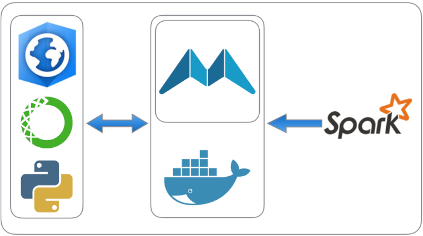
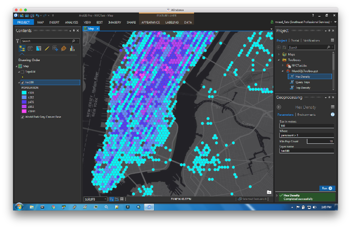
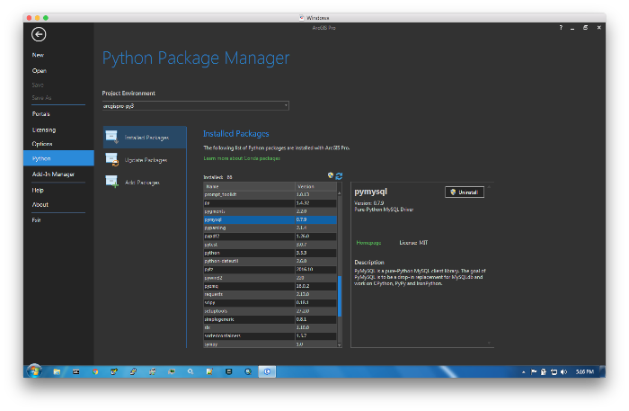
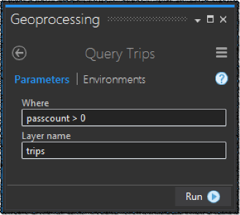
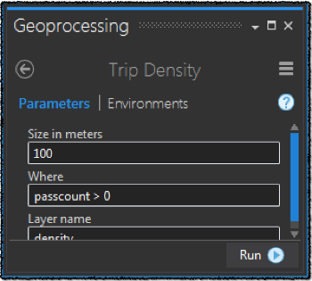
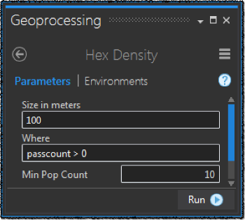

# MemSQL ArcGIS Integration



This PoC integration utilizes:
- [MemSQL Spark Connector](https://github.com/memsql/memsql-spark-connector) to bulk load [NYC taxi trip data](http://www.nyc.gov/html/tlc/html/about/trip_record_data.shtml) into [MemSQL](http://www.memsql.com/).
- [ArcGIS Pro](https://pro.arcgis.com/en/pro-app/) to query, aggregate and view the trips.



## Starting MemSQL

The fastest way to test and develop for MemSQL is to start it in a [Docker](https://www.docker.com/) container. Check out [this](https://docs.memsql.com/docs/quick-start-with-docker) reference as a quick start guide.

```
docker\
 run -d\
 -p 3306:3306\
 -p 9000:9000\
 --name memsql\
 memsql/quickstart
```

## Create MemSQL Database and Table

Start a MemSQL shell in a separate container that is linked to the container named `memsql`:

```
docker run --rm -it --link=memsql:memsql memsql/quickstart memsql-shell
```

Type at the shell prompt:

```sql
create database if not exists trips;
use trips;
drop table if exists trips;
create table trips (
    pdate TIMESTAMP not null,
    ddate TIMESTAMP not null,
    ploc GEOGRAPHYPOINT not null,
    dloc GEOGRAPHYPOINT not null,
    px DOUBLE not null,
    py DOUBLE not null,
    dx DOUBLE not null,
    dy DOUBLE not null,
    p100 TEXT not null,
    d100 TEXT not null,
    passcount INTEGER not null,
    triptime INTEGER not null,
    tripdist DOUBLE not null,
    index (ploc),
    index (dloc),
    index (p100),
    index (d100)
  );
exit;
```

Note how MemSQL can handle geo spatial types natively - Pretty cool :-)

## Bulk Loading Data

`TripApp` is a Scala based [Spark](http://spark.apache.org/) application that uses the [MemSQL Spark Connector](https://github.com/memsql/memsql-spark-connector) to:
- **E**xtract [NYC taxi trip](http://www.nyc.gov/html/tlc/html/about/trip_record_data.shtml) records from a CSV file in an S3 bucket.
- **T**ransform or GeoEnrich the records.
- **L**oad the enriched records into MemSQL.

The GeoEnrichment steps are:
- Filter the input records to be in the "NY area".
- Add pickup and dropoff locations fields in meters using web mercator spatial reference projection.
- Convert pickup and dropoff locations to [WKT POINT](https://en.wikipedia.org/wiki/Point_(geometry)) format, as this is how you store geo spatial feature in MemSQL.
- Convert pickup and dropoff meter locations to centroid of hexagon with 100 meters diameters.  All pickups or dropoffs that overlap the same 100 meter diameter hexagon will be associated with that hexagon centroid value.  Future queries can be composed of aggregations by hexagon values very efficiently to render very expressive maps for pattern detection.

Compile the Spark/Scala application using [Apache Maven](https://maven.apache.org/):

```
mvn clean package
```

The following is a sample job submission where the input CSV file reside in an S3 bucket:

```
spark-submit\
 --conf spark.app.access.key=${AWS_ACCESS_KEY_ID}\
 --conf spark.app.secret.key=${AWS_SECRET_ACCESS_KEY}\
 --conf spark.app.input.path=s3a://mraad-taxis/trips-1M.csv\
 target/memsql-arcgis-0.1-jar-with-dependencies.jar
```

## Viewing The Data

To view the bulk loaded trips, we will extend [ArcGIS](https://pro.arcgis.com/en/pro-app/) with an [ArcPy](http://pro.arcgis.com/en/pro-app/arcpy/get-started/what-is-arcpy-.htm) Toolbox to query MemSQL and view the result set as features on a map.
The protocol used by a client application to communicate with a MemSQL cluster is same as [MySQL](https://www.mysql.com/), enabling us to use a plethora of existing libraries. This is very smart from the MemSQL folks for _not_ inventing yet another protocol.  Since ArcPy is based on Python, we will use [PyMySQL](http://pymysql.readthedocs.io/en/latest/index.html) as it is ([conda](https://www.continuum.io/anaconda-overview)) installed in ArcGIS Pro.



The ArcPy `MemSQLToolbox` consists of 3 tools; QueryTrips, TripDensity, HexDensity.

### QueryTrips



This tool executes the following SQL:

```
    select
    ploc,
    pdate,
    passcount,
    triptime,
    tripdist
    from trips
    where {w}
    and GEOGRAPHY_CONTAINS("POLYGON(({xmin} {ymin},
    {xmax} {ymin},
    {xmax} {ymax},
    {xmin} {ymax},
    {xmin} {ymin}))",ploc)
```

Where `{w}` is the user defined where clause, and `{xmin}`,`{ymin}`,`{xmax}`,`{ymax}` are the current map extent.
The result set of the trip pickup locations is used to create point features that are inserted into an ephemeral feature class and rendered on the map.

### TripDensity



This tool executes the following nested SQL:

```
    select
    T.C*{c1}+{c2} as X,
    T.R*{c1}+{c2} as Y,
    count(*) AS POPULATION from (
        select
        cast(floor(px/{c1}) as signed integer) as C,
        cast(floor(py/{c1}) as signed integer) as R
        from trips where {w}) T
    group by T.R,T.C
```

Imagine a virtual mesh draped over Manhattan where each mesh cell is a square with a side size of `{c1}` meters.  The above SQL calculates the number of pickups per cell and the center (in meters) of the cell. BTW, `{c2}` = `{c1}` / 2.  The inner select converts each pickup (x,y) tuple into a (row,col) tuple. All pickup locations that fall in the same mesh cell will have the same (row,col) tuple value. This is achieved mathematically by taking a coordinate dimension and dividing it by the cell size and flooring the result.  So the x dimension becomes a column value and the y dimension becomes a row value.  The outer select groups all the pickups with the same (row,col) value and counts their concurrence.  The result set is used to create point features that are inserted into an ephemeral feature class that is symbolized based on the count and rendered on the map.

### HexDensity



This tool executes the following SQL:

```
    select p100 as rc,count(p100) as pop
    from trips
    where {w}
    and GEOGRAPHY_CONTAINS("POLYGON(({xmin} {ymin},
    {xmax} {ymin},
    {xmax} {ymax},
    {xmin} {ymax},
    {xmin} {ymin}))",ploc)
    group by p100
    having pop > {p}
```

Imagine again a virtual mesh draped over Manhattan where this time each mesh cell is a hexagon with a 100 meter diameter. the `p100` field was generated at import time during the geo-enrichment process. The above SQL finds all the pickup locations in a specified polygonal geographical area, aggregates the count of concurrent `p100` values and reports back only the resulting rows with concurrent counts greater than `{p}`.  Note that the field `p100` is of type `text` and the values are in the form `number:number`, for example "1234:5678". The first number is the hexagon cell row value and the second number is hexagon column value. The returned `p100` fields are decoded in the ArcPy code in Pro on the fly and converted to polygonal shapes to be rendered on the map.

### Sample Query Code

```python
import pymysql.cursors

connection = pymysql.connect(host='localhost',
                             user='root',
                             db='trips',
                             charset='utf8mb4')
try:
        with connection.cursor() as cursor:
                sql="select px,py from trips limit 10"
                cursor.execute(sql)
                for row in cursor.fetchall():
                        print(row)
finally:
        connection.close()
```
